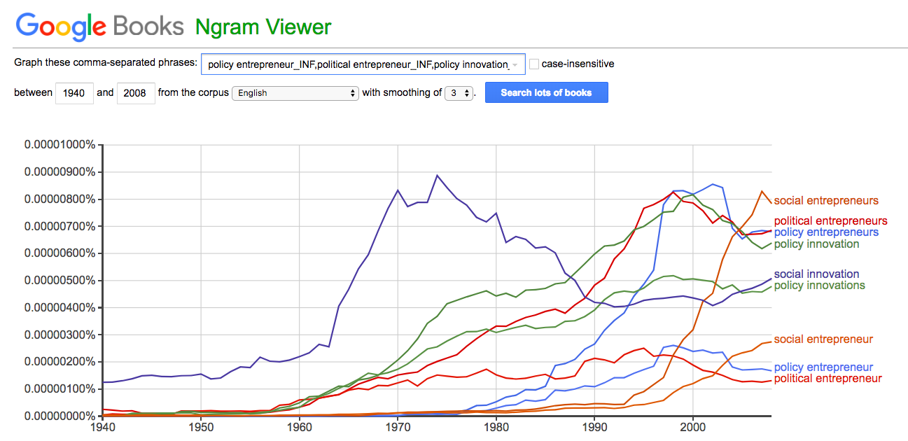

## Abstract
What role do individual agents play in the policy process? Theories of the policy process either specify or leave room for a special class of individuals that drive the policy process. These individuals are often vaguely described as policy entrepreneurs. This paper uses pragmatist method to examine the claims of scholars about what policy entrepreneurs _do_---what actions they take, as opposed to their characteristics or positions. Using immigration enforcement law in the US states in the 2010s as a case, the paper lays out a plan for using interview-based process tracing and network analysis of news media to test scholars' claims against the actions of political actors viewed as instrumental to passing or blocking those laws. Such a study would explore (1) who took actions that determined policy outcomes; (2) which theories of public entrepreneurship prove most predictive of that behavior; and (3) whether public entrepreneurship is the most useful metaphor for describing those actions. This paper aims to contribute to conversations about the role of individual agency in the policy process.

\newpage
## Structure and Agency in Policy Science  
In 1984, political scientist John Kingdon wrote that when attempting to explain change in political systems, "social scientists are inclined to look at structural changes while journalists are inclined to emphasize the right person in the right place at the right time." Both are right, he argued over thirty years ago. Today, political science's institutional roots continue to shape its growth.[^Peters] At an even higher level than institutions and organizations, theories of the policy process such as punctuated equilibrium have helped us build a macroscopic understanding of the policy process, explaining why policy environments show long periods of relative stability punctuated by rapid change.[^B&J93][^Epp] 

At the microscopic level, scholars have asked a very different set of questions: Amidst all of this structure, who are the agents responsible for creating those structures, institutions and organizations? What do they do? In both implicit and explicit ways, policy process theories contain clues to the role of individual actors in the policy process: The multiple streams framework (MSF) has two types of actors: Brokers that define problems, and entrepreneurs that couple the problem, policy and political streams.[^Knaggard]. In the policy stages framework, individuals set agendas, articulate problems, and identify solutions.[^Anderson] In the narrative policy framework (NSF), effective political actors build and spread narratives, defining the policy setting, characters, plot and conflict.[^McBeth]. In the advocacy coalition framework (ACF), effective political actors construct, maintain, and broker across subsystems.[^MintromVergari] In information processing theory (IPT), which incorporates punctuated equilibrium theory and agenda-setting, actors process information--usually poorly; but key actors might also be seen as driving information flow or processing information more effectively.[^Jones12] The institutional analysis and design framework (IAD) views actors primarily as making choices from received options, but actors might also architect others' choice environments.[^Ostrom] 

## Entrepreneurship as Agency in Policy Science: A Review  
What should we call these actors within political systems? In line with Kingdon footsteps, some scholars have taken to using the phrase _public entrepreneur_ and its variants (see Appendix A for comparisons). In a political universe where a problem, a solution and the political landscape all have to line to provide a window of opportunity for a particular policy, Kingdon's policy entrepreneurs are those individuals prepared with well-developed policy solutions. But Kingdon wasn't the first author to use such a phrase: In 1974, democratic theorist Robert Dahl introduced the concept of the political entrepreneur as someone "who has the skill and the drive" to take advantage of "unusual opportunities for pyramiding a small amount of initial resources into a sizable political holding."[^Dahl] And long before Dahl and Kingdon, Joseph Schumpeter described political entrepreneurs as primarily competing to win elections by offering packages of policies for voters to choose from.[^Schumpeter] The last thitry years of work in policy entrepreneurship has raised, if not answered, further questions about policy entrepreneurs: **Who are they? What do they do?** And more fundamentally, **is entrepreneurship an appropriate metaphor to use in policy science?**
  
### Who Are Policy Entrepreneurs? 
Michael Mintrom argues that policy entrepreneurs are creative and insightful and socially perspective, able to mix in a variety of social and political settings, argue persuasively, strategically build teams and lead by example.[^Mintrom00] Other scholars have imbued policy entrepreneurs with a range of characteristics: They have "skill and drive,"[^Dahl] are rational actors alert to opportunity,[^Shockley] and are attached to single issues.[^STM] They are idea-oriented risk-takers that can coordinate the actions of others[^Mintrom00] and "agents for policy change who possess the knowledge, power, tenacity and luck to be able to exploit key opportunities."[^Cairney]

Joseph Schumpeter thought somewhat less of public entrepreneurs: "The typical citizen drops down to a lower level of mental performance as soon as he enters the political field. He argues and analyzes in a way which he would readily recognize as infantile within the sphere of his real interests. He becomes primitive again."[^Schumpeter] 

Schumpeter's views aside, where do we find these seemingly superhuman political actors? Scholars maintain multiple perspectives on where policy entrepreneurs sit within the political system. For Kingdon, policy entrepreneurs had to be positioned somewhere in the political system to give them a "claim to a hearing," implying that policy entrepreneurs and policymakers are separate. Others view policy entrepreneurs as the originator of a venture or organization, implicitly excluding inside advocates or policy brokers.[^Medvetz] They are sometimes assumed to be in positions of leadership, and in other work street-level bureaucrats.[^Arnold] Grossman finds that "institutionalized entrepreneurs," presidents and long-serving members of Congress, are the most effective policy actors.[^Grossman]

What are these actors trying to accomplish? There are some clues in the descriptors above. For public choice scholars, such entrepreneurs are motivated by political profit.[^Wagner]  This is variably defined as electoral success as successfully pushing through policies on "a single issue about which they [care], often with a passion."[^STM] Others suggest a more intrinsic driver, the "pleasure of manipulating, creating or renovating organisations."[^Bäck] As Adam Sheingate points out, political entrepreneurs can maintain multiple, and even ambiguous, goals.[^Sheingate] These can include electoral success, policy change, or the building of particular institutions or organizations. 

### What Do Policy Entrepreneurs Do? 
In the early 20th century, pragmatist philosopher Charles Sanders Peirce wrote: 

> "Consider the practical effects of the objects of your conception. Then, your conception of those effects is the whole of your conception of the object"[^Peirce]

Peirce's work laid the foundation for the philosophical pragmatist tradition, which placed emphasis on examining actions and their effects: On what _happens_, rather than what _seems to be_. In this case, focusing on what so-called public entrepreneurs _do_ may cut through some of the ambiguity about who public entrepreneurs _are_. To that end, below is a list of the actions policy scholars hypothesize that public entrepreneurs take, grouped---loosely---into testable categories.

\newpage
#### The Many Tasks of the Public Entrepreneur 

| Category of Action | Action                                  | Author(s)                     | 
|---------------------|----------------------------------------|-------------------------------|
| Strategize                        | Formulate and execute on strategy | Roberts 1998 |
| Set agendas                       | Shape terms of debate |  Mintrom 2000 |
|                                   | Move streams "like Poseidon" | Cairney 2018 |
|                                   | Influence the " arena" (time and place of decisions) | Brouwer and Biermann 2011 Jones 1993 |
|                                   | | Anderson 1975 |
| Identify problems                 | Wait for the "big wave" | Cairney 2018 |
| and opportunities                 | Identify opening of policy windows | Kingdon 1984 | 
|                                   | Spot an auspicious moment | Ross 2019 | 
|                                   | | Mintrom 2000 | 
|                                   | | Anderson 1975 | 
| Define problems                   | Construct narratives | McBeth et al, 2014 |
|                                   | | Roberts 1998 | 
|                                   | | Knaggard 2015 (on brokers) | 
| Develop solutions                 | Generate ideas | Roberts 1998 |
|                                   | Invent the product | Medvetz 2010 | 
|                                   | Produce feasible solutions in advance | Cairney 2018 | 
|                                   | | Anderson 1975 | 
|                                   | | Kingdon 1984 | 
| Couple problem                    | | Kingdon 1984 | 
| and solution                      | | Ross 2019 | 
| Sell solutions                    | Market the product |  Medvetz 2010 | 
|                                   | Tell a story to grab audience interest | Cairney 2018 | 
|                                   | Disseminate ideas | Roberts 1998 | 
|                                   | Promote a position | Kingdon 1984 | 
|                                   | Select solution | Roberts 1998 | 
|                                   | Spread narratives | McBeth et al, 2014 | 
|                                   | Seek attention | Brouwer and Biermann 2011 | 
| Create networks                   | Crosses borders and connects the interests of different actors | Andersson (on civic entrepreneurs)  | 
|                                   | Network | Mintrom 2000 | 
|                                   | Link (coalition building) | Brouwer and Biermann 2011 | 
|                                   | Broker across subsystems | Mintrom and Vergari | 
|                                   | Couple steams | Kingdon 1984 | 
|                                   | Seek support | Brouwer and Biermann 2011 | 
| Build organizations               | Create the venture | Medvetz 2010 | 
|                                   | Manipulate create or renovate organisations | Bäck 2006 | 
|                                   | Pyramid a small amount of initial resources into a sizable political holding | Dahl 1974 |
|                                   | Gather resources for a cause | Ross 2019 |

These categories are not exhaustive and mutually exclusive. They cannot be, as they emerge from often opposing theories of the political process. It may be that political agents spot problems, for example, or that they invent them in order to gain political advantage. It could be that constructing a narrative is a prerequisite to building a network of support, or that individuals significantly adjust narratives in response to feedback from their efforts to recruit. Instead of representing final categories, this list provide a starting point for identifying testable hypotheses of what constitutes entrepreneurial behavior in a political context. 

Also of note are the absence of two of the dominant frameworks for understanding the policy process: Information processing theory (IPT) and institutional analysis and design (IAD).[^Ostrom] In institutional analysis and design, actors are understood as making choices from given options. Information processing theory, an evolution of punctuated equilibrium theory, is mostly silent on the role of individual actors, though in _The Politics of Information_, Baumgartner and Jones do suggest that the "airline deregulation [of the 1970s] may not have been possible without Senator [Ted] Kennedy's entrepreneurship."[^Jones15]. The table below suggests roles that individuals could play in the political systems imagined by these theories: 

\newpage
#### Roles for Key Actors in Ostrom's IAD and Jones & Baumgartner's IPF
| Theory / Framework                | Action                                                              | 
|-----------------------------------|---------------------------------------------------------------------|
| Institutional Analysis and Design | Design constitutional choice situations |
|                                   | Design collective choice situations |
|                                   | Design operating choice situations |
| Information Processing            | Broker across subsystems in order to gather diverse information |
|                                   | Identify existing institutions' information processing failures |
|                                   | Direct attention to processing failures |
|                                   | Direct attention away from processing failures in order to take advantage of them |
|                                   | Build organizations and institutions that can process information | 

In Ostrom's IAD framework, the most effective political actors might be viewed more as architects than entrepreneurs. In Baumgartner and Jones's information processing theory, political actors may serve multiple roles, including as gatherers, synthesizers and disseminators of information, both pre- and post-processing, or perhaps what Workman et al call "attention-directors."[^Workman] They might also, per Sheingate, be understood as "endogenous agents of change."[^Sheingate]

### Is Entrepreneurship the Right Metaphor for Policy Science? 
Consistent in much of the work above is the underlying assumption that _entrepreneur_ is a useful category in a policy context. Not all scholars agree. When Dahl introduced the phrase "political entrepreneur," he introduced it primarily as metaphor, one that may have been stretched too far and wide to be useful.[^MP] For Capano and Howlett, _leadership_ is often a more useful descriptor: “[political] change agents might or might not be entrepreneurial, but they are definitely leaders.”[^Capano] And in their work on _inside activists_, Olsson and Hysing argue that that "the concept [of policy entrepreneurship] is imprecise, as almost every actor is a potential policy entrepreneur, pushing for any kind of value or interest, not necessarily their own."[^Olsson] Depending on the author, policy entrepreneurs might tend to be policymakers or not, equivalent or distinct from policy brokers, individuals or institutions. 

## Looking for Entrepreneurial Action: A Pragmatic Approach
This paper aims to cut through the ambiguity around policy entrepreneurs by focusing on what effective political actors _do_. The process follows four questions: 

 1. Among those actors believed to be important in passing or blocking a policy, what significant actions did they take?
 2. How are those important actions distributed among different players? Do groups of actions tend to be taken by single individuals, or to be spread out among multiple actors? 
 3. If there are identifiable key actors in policy change, what action do they take? Does it make sense to call them _entrepreneurial_, or might there be another label (or set of labels) that is more appropriate? 
 4. Is the presence or absence of these individuals associated with policy success or failure? 
 
To answer these questions requires a point of comparison: Similar policies that failed in some instances and succeeded in others. The 50 US States provide fertile territory for this comparative work. Michael Barber's 2015 work on campaign finance polarization, for example, leveraged comparisons across US states.[^Barber] Michael Mintrom's 2000 book _Policy Entrepreneurs and School Choice_ began with surveys asking political actors in multiple states to identify policy entrepreneurs in their own contexts. This paper looks at a set of bills on immigration enforcement that were introduced across over 30 states from 2010-2017 in the wake of Arizona's passing of Senate Bill 1070 in 2010. 

## The Setting: Immigrant Enforcement Policies in the US States, 2010-2017 
In 2010, Arizona passed Senate Bill 1070, which "criminalizes failure to carry proof of legal immigration status as a state misdemeanor; requires the police to determine the immigration status of a person detained in a lawful stop, detention, or arrest if there is a reasonable suspicion that the person might be undocumented; and prohibits local and state officials from limiting or restricting enforcement of federal immigration laws."[^Wallace] To supporters, the bill was designed to respond to the failure of the federal government to enforce immigration law; to detractors, the bill was anti-immigrant and racially-motivated. Anti-immigrant legislation had been building up in Arizona since 2004.[^Campbell]  Within a year, 23 states had attempted to pass bills similar to SB 1070, and six had succeeded: Arizona, Alabama, Georgia, South Carolina, Utah, and Mississippi. [^Lacayo] 

From 2015, another wave of similar bills were introduced in state legislatures. North Carolina, Texas and Florida, states that had introduced but failed to pass SB 1070 copycat bills in 2011, passed sweeping anti-immigrant bills between 2015 and 2017. At least 33 states introduced anti-sanctuary bills in that period. Together these bills provide a useful comparative test bed to ask the question: Who did what? Then we can see whether those actions--or the absence of some of those actions--are associated with failure or success. [^NCSL] 

## Methods: Process Tracing and Network Analysis 
In 1971, Graham T. Allison published _The Essence of Decision_, in which he analyzed the Cuban Missile Crisis through three distinct lenses: rational choice theory, the organizational process model, and the governmental politics model.[^Allison] Over 40 years later, Greg Fisher applied what would come to be called Allison's technique of _alternative templates research strategy_ to test three theories of entrepreneurship: causation, effectuation and bricolage.[^Fisher] Fisher first delineated which activities might be expected according to each theory, then made use of interviews and secondary research to construct cases to test the strength of each theory. This paper adds to that strategy recent work on process tracing, as described by David Collier.[^Collier] Process tracing is a qualitative method for establishing causality in ambiguous environments or those with a small number of observations. Through interviews and case compilations, process tracing identifies which important events happened in which order, then tests alternate hypotheses against available facts. 

This paper takes a similar approach, with the addition of two other methods: Network analysis and process tracing. In the field of network analysis, there are four primary methods of gathering information about social networks: Name generators, which ask people to list their friends and colleagues; position generators, which ask people to list individuals belonging to pre-specified social and professional positions; resource generators, which ask people to list individuals that are able to provide a specific resource; and observation, often through large-scale social media networks.[^Snijders] In his 2000 study of school choice entrepreneurs, Michael Mintrom applied a sort of the position generator: He asked  which individuals respondents would describe as public entrepreneurs of school choice, then asked questions about those them.[^Mintrom00] This paper makes use of a modified version of the social network resource generator: Instead of asking which individuals can provide certain resources to a person, it generates names from lists of actions. 

Together, these methods provide a way to test the various claims made by scholars of public entrepreneurship. In order to do that, I will construct four cases: Two states which passed immigration enforcement laws between 2010 and 2017, and two states in which laws were introduced but failed to pass. In each case, I will first conduct text analysis of the news articles surrounding the bill, using the resulting co-citation matrix to determine which actors were viewed as central to the passing (or failure) of each bill. 

The second step will be semi-structured interviews with four key participants in each state. Each interview will begin with an open-ended name-generator question, designed to elicit the names that each interviewee considers most important to the attempted or successful passing or failure of a bill: "What made the passage or blocking of this bill possible" and "Who did that?"

The second part of the interview will begin with an open-ended series of questions about each of the names that the interviewee provided, in addition to a small number of the key actors generated by text analysis. These questions will be designed to elicit the critical actions taken by each key player: "What did that person do in pursuit of passing or blocking the bill?" and "When was that?"

The third part of the interview will consists of specific questions designed to test hypotheses about the actions scholars posit that policy entrepreneurs might take: "Who did the following?" from the lists constructed above. By way of example: Cairney hypothesizes that entrepreneurs produce "feasible solutions in anticipation of attention to problems."[^Cairney] In this scenario, Cairney's policy entrepreneurs are responsible for generating solutions to a problem in anticipation of a window, and then take advantage of policymakers' limited window of attention to an issue in order to push through a policy. 

This hypothesis by Cairney can be divided into three separate claims: 

1. Policymakers and policy entrepreneurs are (generally) separate individuals: Entrepreneurs generate the solutions that policymakers choose from
2. Someone tends to prepare solutions in advance of some event that calls them into action 
3. Policymakers pay fleeting attention to any given issue, given the number of issues they must attend to 

An alternate set of hypotheses might argue the following: 

1. Policymakers tend to generate their own solutions to problems, or define problems to justify the solutions they are interested in 
2. Policymakers and other actors often make up ideas as they go along; bills that get passed often include ideas generated during the policymaking process
3. Policymakers tend to be focused on a small subset of issues to which they remain committed over time 

The following questions would test these opposing hypotheses:

1. Where did the ideas in the bill (and amendments) come from? Whose ideas was that? 
2. When did they have that idea? 
3. Have these policymakers been active on this issue prior to and following the event? What have they done? 

This is one example of how hypotheses of policy entrepreneurs' actions might be tested. By going through each of the actions that scholars attribute to entrepreneurs, we can identify particular behaviors that are associated with policy success, then build theory inductively from that observed behavior. Determining whether that behavior is best described as _entrepreneurial_ might then be determined by the degree to to which those behaviors line up with popular use of the word _entrepreneur_ and/or conceptions of entrepreneurship from management literature, which studies the original context from which political scientists have borrowed the metaphor. 

## Future Work: Co-Mentions, Text Analysis, and Diffusion 
The shift from studying categories to behaviors opens up a number of other research possibilities. The first is quantitative network analysis of actors in the political process and their behaviors. One way to build such a database would be to examine the local news media around an issue. While not a perfect reflection of internal political actions, journalists attempt to identify key players and to describe the actions they took. Text mining of local media could generate two outcomes: First, a co-mention analysis of actors mentioned in connection with a certain issue; and second, a text analysis of the verbs (actions) associated with each player over time. This approach could also test hypotheses that organizations act as entrepreneurs, by observing the degree to which journalists and those they interview attribute actions to groups or individuals. The co-mentions network would also reveal who is at the center of public coverage of a policy, reflecting the public's perception of who is important to that policy. This data would provide a useful comparison to the self-reported data from the interviews above. 

A second potential direction would be to compare the results of a national text mining exercise to the predictions of policy implementation present in the policy diffusion literature. This would be one way to conduct an overall test of whether the presence or absence of individual actors matter: To what degree do their actions speed up or slow the pace of policy adoption predicted by diffusion models? 

A third direction would be to conduct a similar exercise, but with hypotheses chosen from management literature on entrepreneurship. Much of management scholars' work on market entrepreneurs echoes the theories and frameworks of the policy process, but two threads of research stand out as areas of particular opportunity. First, work on entrepreneurial strategy considers the degree to which entrepreneurs plan by "doing" (improvisation) or "thinking" (planning, usually with mental models or analogies).[^Ott] A second body of research examines the cognitive processes of entrepreneurs, examining the degree to which entrepreneurs use employ different cognitive processes than non-entrepreneurs.[^Mitchell]

## Conclusion
In 1988, Per Bak and his colleagues published "Self-Organized Criticality," an article that uses the metaphor of a growing sandpile to describe their mathematical concept: As grains of sand fall into a pile, a moment approaches in which just one more grain of sand can lead to cascades in the pile.[^Bak][^Brunk] As with Jones and Baumgartner's punctuated equilibirum theory, such a description leaves little room for individual agency: What sense does it make to ask about the motivations, characteristics of a grain of sand or the cognitive processes of tectonic plates? Unlike grains of sand or tectonic plates, however, humans have the capacity to reflect on and manipulate the environment around us. The study of individual agents' efforts to do that can contribute to our understanding of the systems they create, adjust and destroy in the political environment. This paper aims to contribute to that inquiry by examining the actions of policy entrepreneurs, a particular type of agent that appears throughout policy process literature as actively shaping the institutions, organizations and political systems around them. 

\newpage

\newpage
### Appendix A: Mentions of Types of Entrepreneurship Over Time 
{#id .class width=600}
Much less prevalent search terms included: _public_ and _civic entrepreneur(s)_; _public_, _policy_, _political_ and _civic entrepreneurship_; and _civic_, _public_, and _political innovation(s)_. Original chart available at https://goo.gl/mpAxgE. 

### Appendix B: Actions of Entrepreneurs in Management Scholarship 
| Action                                                      | Author(s)             | Relevant Policy Theories | 
|--------------------------------------------------|-----------------------|-------------------------
| Broker structural hole, esp. between innovators and markets |Burt, Chen | ACF |
| Build firms and industries                                  |Santos and Eisenhardt | NPF, IAD | 
| Make and deploy culture                                     |Gehman | NPF |  
| Assemble otherwise overlooked resources                     |Fisher, Ventresca | MSF | 
| Build coalitions and ideas simultaneously                   |Sarasvathy | NPF | 
| Process information through cognitive heuristics            |Mitchell | IPT |
| Discover / create product-market fit                        |Geroski | Stages, MSF, NPF | 
| Plan v. improvise                                           |Ott et al | MSF | 
| Innovate at the intersection of technology, markets and organizational structure | Hajek and Ventresca | MSF |

\newpage
## References 
Aldrich, J. H. (1995). Why parties?: The origin and transformation of political parties in America. University of Chicago Press.

Allison, G. T. (1971). Essence of decision. Boston: Little, Brown, 536.

Anderson, J.E. (1975). Public Policy-Making. New York:Praegar.

Arnold, G. (2015). Street-level policy entrepreneurship. Public Management Review, 17(3), 307-327.

Baumgartner, F. R., & Jones, B. D. (1993). Agendas and instability in American politics. University of Chicago Press.

Bäck, H., Heinelt, H., & Magnier, A. (2006). The European Mayor. Springer Fachmedien.

Bak, P., Tang, C., & Wiesenfeld, K. (1988). Self-organized criticality. Physical review A, 38(1), 364.

Barber, Michael J. "Ideological Donors, Contribution Limits, and the Polarization of American Legislatures." The Journal of Politics 78.1 (2016): 296-310.

Baumgartner, F. R., & Jones, B. D. (2015). The politics of information: Problem definition and the course of public policy in America. University of Chicago Press.

Brunk, G. G. (2001). Self-organized criticality: A new theory of political behaviour and some of its implications. British Journal of Political Science, 31(2), 427-445.

Cairney, P. (2018). Three habits of successful policy entrepreneurs. Policy & Politics, 46(2), 199-215.

Campbell, K. M. (2011). The road to SB 1070: How Arizona became ground zero for the immigrants' rights movement and the continuing struggle for Latino civil rights in America. Harv. Latino L. Rev., 14, 1.

Capano, G., & Howlett, M. (2009). A research agenda for policy dynamics. European and North American Policy Change: Drivers and Dynamics, 61, 217.

Collier, D. (2011). Understanding process tracing. PS: Political Science and Politics, 44(4), 823-830. doi:10.1017/S1049096511001429

Dahl, R. A. (2005). Who governs?: Democracy and power in an American city. Yale University Press.

Epp, D. A. (2018). The structure of policy change. University of Chicago Press.

Fisher, G. (2012). Effectuation, causation, and bricolage: A behavioral comparison of emerging theories in entrepreneurship research. Entrepreneurship theory and practice, 36(5), 1019-1051.

Grossmann, M. (2014). Artists of the possible: Governing networks and American policy change since 1945. Oxford University Press.

Jones, B. D. (2001). Politics and the architecture of choice: Bounded rationality and governance. University of Chicago Press.

Jones, B. D., & Baumgartner, F. R. (2012). From there to here: Punctuated equilibrium to the general punctuation thesis to a theory of government information processing. Policy Studies Journal, 40(1), 1-20.

Kingdon, J. W., & Thurber, J. A. (1984). Agendas, alternatives, and public policies. Boston: Little, Brown.

Knaggård, Å. (2015). The Multiple Streams Framework and the problem broker. European Journal of Political Research, 54(3), 450-465.

Lacayo, A. E. (2011). One year later: a look at sb 1070 and copycat legislation. National Council of La Raza. Accessed at http://www.theskinnyblog.com/bitstream/handle/123456789/666/A_look_at_SB_1070.pdf?sequence=1&isAllowed=y

McBeth, M. K., Jones, M. D., & Shanahan, E. A. (2014). The narrative policy framework. Theories of the policy process, 3, 225-266.

Medvetz, T. (2010). “Public Policy is Like Having a Vaudeville Act”: Languages of Duty and Difference among Think Tank-Affiliated Policy Experts. Qualitative Sociology, 33(4), 549-562.

Mintrom, M. (2000). Policy entrepreneurs and school choice. Georgetown University Press.

Mintrom, M., & Vergari, S. (1996). Advocacy coalitions, policy entrepreneurs, and policy change. Policy studies journal, 24(3), 420-434.

Mitchell, R. K., Busenitz, L., Lant, T., McDougall, P. P., Morse, E. A., & Smith, J. B. (2002). Toward a theory of entrepreneurial cognition: Rethinking the people side of entrepreneurship research. Entrepreneurship theory and practice, 27(2), 93-104.

Miles, L., Aflaki, I. N., & Petridou, E. (2016). Unpacking the Theoretical Boxes of Political Entrepreneurship. In Entrepreneurship in the Polis (pp. 19-34). Routledge.

Morse, Ane. (2017). "What’s a Sanctuary Policy? FAQ on Federal, State and Local Action on Immigration Enforcement." National Council on State Legislatures. Accessed at http://www.ncsl.org/research/immigration/sanctuary-policy-faq635991795.aspx

Olsson, J., & Hysing, E. (2012). Theorizing inside activism: Understanding policymaking and policy change from below. Planning Theory & Practice, 13(2), 257-273.

Polski, M. M., & Ostrom, E. (1999). An institutional framework for policy analysis and design. 1999.

Ott, T. E., Eisenhardt, K. M., & Bingham, C. B. (2017). Strategy formation in entrepreneurial settings: Past insights and future directions. Strategic Entrepreneurship Journal.

Peirce, C. S., & Hetzel, A. (1878). How to make our ideas clear.

Peters, B. G. (2011). Institutional theory in political science: The new institutionalism. Bloomsbury Publishing USA.

Ross, L. C. (2019). Policy Entrepreneurship: A Guide to Shaping and Understanding Policy. Brookings Institution Press.

Schumpeter, J. A. (2010). Capitalism, socialism and democracy. routledge.

Sheingate, A. D. (2003). Political entrepreneurship, institutional change, and American political development. Studies in American Political Development, 17(2), 185-203.

Shockley, G., Frank, P. M., & Stough, R. (2002, March). Toward a theory of public sector entrepreneurship. In NCIIA 7th Annual Meeting, Boston (pp. 20-22).

Van Der Gaag, M., & Snijders, T. A. (2005). The Resource Generator: social capital quantification with concrete items. Social networks, 27(1), 1-29.

Schneider, M., Teske, P., & Mintrom, M. (2011). Public entrepreneurs: Agents for change in American government. Princeton University Press.

Wagner, R. E. (1966). Pressure groups and political entrepreneurs: A review article. Papers on Non-Market Decision Making, 1(1), 161-170.

Wallace, S. J. (2014). Papers Please: State‐Level Anti‐Immigrant Legislation in the Wake of Arizona's SB 1070. Political Science Quarterly, 129(2), 261-291.

Workman, S., Jones, B. D., & Jochim, A. E. (2009). Information processing and policy dynamics. Policy Studies Journal, 37(1), 75-92.

\newpage
### Further Reading
Alexandra Fillindra, “Bringing the States into the Immigration Debate: The Role of Political Institutions and Interest Groups in State‐Level Immigration Policy Formation” (paper presented at the annual meeting of the Western Political Science Association, San Diego, Calif., March 2008)

Alexandra Fillindra and Daniel J. Tichenor, “Beyond Myths of Federal Exclusivity: Regulating Immigration and Noncitizens in the States” (paper presented at the American Political Science Association, Boston, Mass., August 2008).

Colbern, A., & Ramakrishnan, S. K. (2018). Citizens of California: How the Golden State Went from Worst to First on Immigrant Rights. New Political Science, 1-15.

Drutman, L. "Political Dynamism." In New Entrepreneurial Growth Agenda (Stangler, Dane, Ed.). Kauffman Foundation. Accessed from https://www.kauffman.org/neg/section-8#politicaldynamism. 

Hall, P. A., & Taylor, R. C. (1996). Political science and the three new institutionalisms. Political studies, 44(5), 936-957.

Katznelson, I., & Weingast, B. R. (Eds.). (2005). Preferences and Situations: Points of Intersection Between Historical and Rational Choice In. Russell Sage Foundation.

Miroff, B. (2003). Entrepreneurship and Leadership. Studies in American Political Development, 17(2), 204-211. doi:10.1017/S0898588X03000130

Pancaldi, F. (2012). The Turn to Real Actors: Achievements and Challenges for Actor-Centered Institutionalism in the Comparative Political Economy. Paper for the XXVI Convegno SISP, Rome, 13.

Ramakrishnan, K., & Colbern, A. (2015). The “California Package” of immigrant integration and the evolving nature of state citizenship.

Rawat, P., & Morris, J. C. (2016). Kingdon's “Streams” Model at Thirty: Still Relevant in the 21st Century?. Politics & Policy, 44(4), 608-638.

Scherer, A. G., Palazzo, G., & Matten, D. (2014). The business firm as a political actor: A new theory of the firm for a globalized world. Business & Society, 53(2), 143-156.

[^Aldrich]: Aldrich, J. H. (1995). Why parties?: The origin and transformation of political parties in America. University of Chicago Press.
[^Allison]: Allison, G. T. (1971). Essence of decision. Boston: Little, Brown, 536.
[^Anderson]: Anderson, J.E. (1975). Public Policy-Making. New York:Praegar.
[^Arnold]: Arnold, G. (2015). Street-level policy entrepreneurship. Public Management Review, 17(3), 307-327.
[^B&J93]: Baumgartner, F. R., & Jones, B. D. (1993). Agendas and instability in American politics. University of Chicago Press.
[^Bäck]: Bäck, H., Heinelt, H., & Magnier, A. (2006). The European Mayor. Springer Fachmedien.
[^Bak]: Bak, P., Tang, C., & Wiesenfeld, K. (1988). Self-organized criticality. Physical review A, 38(1), 364.
[^Barber]: Barber, Michael J. "Ideological Donors, Contribution Limits, and the Polarization of American Legislatures." The Journal of Politics 78.1 (2016): 296-310.
[^Brunk]: Brunk, G. G. (2001). Self-organized criticality: A new theory of political behaviour and some of its implications. British Journal of Political Science, 31(2), 427-445.
[^Cairney]: Cairney, P. (2018). Three habits of successful policy entrepreneurs. Policy & Politics, 46(2), 199-215.
[^Campbell]: Campbell, K. M. (2011). The road to SB 1070: How Arizona became ground zero for the immigrants' rights movement and the continuing struggle for Latino civil rights in America. Harv. Latino L. Rev., 14, 1.
[^Capano]: Capano, G., & Howlett, M. (2009). A research agenda for policy dynamics. European and North American Policy Change: Drivers and Dynamics, 61, 217.
[^Collier]: Collier, D. (2011). Understanding process tracing. PS: Political Science and Politics, 44(4), 823-830. doi:10.1017/S1049096511001429
[^Dahl]: Dahl, R. A. (2005). Who governs?: Democracy and power in an American city. Yale University Press.
[^Epp]: Epp, D. A. (2018). The structure of policy change. University of Chicago Press.
[^Fisher]: Fisher, G. (2012). Effectuation, causation, and bricolage: A behavioral comparison of emerging theories in entrepreneurship research. Entrepreneurship theory and practice, 36(5), 1019-1051.
[^Grossman]: Grossmann, M. (2014). Artists of the possible: Governing networks and American policy change since 1945. Oxford University Press.
[^Jones]: Jones, B. D. (2001). Politics and the architecture of choice: Bounded rationality and governance. University of Chicago Press.
[^Jones12]: Jones, B. D., & Baumgartner, F. R. (2012). From there to here: Punctuated equilibrium to the general punctuation thesis to a theory of government information processing. Policy Studies Journal, 40(1), 1-20.
[^Jones15]: Baumgartner, F. R., & Jones, B. D. (2015). The politics of information: Problem definition and the course of public policy in America. University of Chicago Press.
[^Kingdon]: Kingdon, J. W., & Thurber, J. A. (1984). Agendas, alternatives, and public policies. Boston: Little, Brown.
[^Knaggard]: Knaggård, Å. (2015). The Multiple Streams Framework and the problem broker. European Journal of Political Research, 54(3), 450-465.
[^Lacayo]: Lacayo, A. E. (2011). One year later: a look at sb 1070 and copycat legislation. National Council of La Raza. Accessed at http://www.theskinnyblog.com/bitstream/handle/123456789/666/A_look_at_SB_1070.pdf?sequence=1&isAllowed=y
[^McBeth]: McBeth, M. K., Jones, M. D., & Shanahan, E. A. (2014). The narrative policy framework. Theories of the policy process, 3, 225-266.
[^Medvetz]: Medvetz, T. (2010). “Public Policy is Like Having a Vaudeville Act”: Languages of Duty and Difference among Think Tank-Affiliated Policy Experts. Qualitative Sociology, 33(4), 549-562.
[^Mintrom00]: Mintrom, M. (2000). Policy entrepreneurs and school choice. Georgetown University Press.
[^MintromVergari]: Mintrom, M., & Vergari, S. (1996). Advocacy coalitions, policy entrepreneurs, and policy change. Policy studies journal, 24(3), 420-434.
[^Mitchell]: Mitchell, R. K., Busenitz, L., Lant, T., McDougall, P. P., Morse, E. A., & Smith, J. B. (2002). Toward a theory of entrepreneurial cognition: Rethinking the people side of entrepreneurship research. Entrepreneurship theory and practice, 27(2), 93-104.
[^MP]: Miles, L., Aflaki, I. N., & Petridou, E. (2016). Unpacking the Theoretical Boxes of Political Entrepreneurship. In Entrepreneurship in the Polis (pp. 19-34). Routledge.
[^NCSL]: Morse, Ane. (2017). "What’s a Sanctuary Policy? FAQ on Federal, State and Local Action on Immigration Enforcement." National Council on State Legislatures. Accessed at http://www.ncsl.org/research/immigration/sanctuary-policy-faq635991795.aspx
[^Olsson]: Olsson, J., & Hysing, E. (2012). Theorizing inside activism: Understanding policymaking and policy change from below. Planning Theory & Practice, 13(2), 257-273.
[^Ostrom]: Polski, M. M., & Ostrom, E. (1999). An institutional framework for policy analysis and design. 1999.
[^Ott]: Ott, T. E., Eisenhardt, K. M., & Bingham, C. B. (2017). Strategy formation in entrepreneurial settings: Past insights and future directions. Strategic Entrepreneurship Journal.
[^Peirce]: Peirce, C. S., & Hetzel, A. (1878). How to make our ideas clear.
[^Peters]: Peters, B. G. (2011). Institutional theory in political science: The new institutionalism. Bloomsbury Publishing USA.
[^Ross]: Ross, L. C. (2019). Policy Entrepreneurship: A Guide to Shaping and Understanding Policy. Brookings Institution Press.
[^Schumpeter]: Schumpeter, J. A. (2010). Capitalism, socialism and democracy. routledge.
[^Sheingate]: Sheingate, A. D. (2003). Political entrepreneurship, institutional change, and American political development. Studies in American Political Development, 17(2), 185-203.
[^Shockley]: Shockley, G., Frank, P. M., & Stough, R. (2002, March). Toward a theory of public sector entrepreneurship. In NCIIA 7th Annual Meeting, Boston (pp. 20-22).
[^Snijders]: Van Der Gaag, M., & Snijders, T. A. (2005). The Resource Generator: social capital quantification with concrete items. Social networks, 27(1), 1-29.
[^STM]: Schneider, M., Teske, P., & Mintrom, M. (2011). Public entrepreneurs: Agents for change in American government. Princeton University Press.
[^Wagner]: Wagner, R. E. (1966). Pressure groups and political entrepreneurs: A review article. Papers on Non-Market Decision Making, 1(1), 161-170.
[^Wallace]: Wallace, S. J. (2014). Papers Please: State‐Level Anti‐Immigrant Legislation in the Wake of Arizona's SB 1070. Political Science Quarterly, 129(2), 261-291.
[^Workman]: Workman, S., Jones, B. D., & Jochim, A. E. (2009). Information processing and policy dynamics. Policy Studies Journal, 37(1), 75-92.